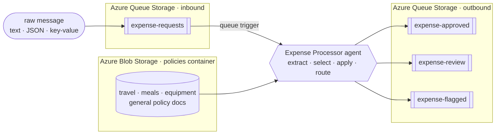

# Serverless Expense Processor Agent [](https://www.python.org/downloads/)

A markdown-first [Azure Functions serverless agent](https://learn.microsoft.com/azure/azure-functions/functions-serverless-agents-runtime)
for queue-driven expense processing. Its trigger and instructions live in
[`src/agents/expense_processor.agent.md`](src/agents/expense_processor.agent.md), and Azure Functions
handles execution and scale-to-zero.

## What it does

- 🧾 **Reads any format:** text, email, key/value, or JSON, and extracts amount, currency, category,
  and vendor.
- 📚 **Picks the right policy:** lists the documents in Blob Storage and selects the one whose scope
  matches, then reads and applies it.
- 🚦 **Routes the decision:** `approve` → `expense-approved`, `review` → `expense-review`,
  `flag` / FX → `expense-flagged`.
- 🔀 **Proves it's reasoning:** the same $450 is auto-approved as travel but sent to review as a
  client dinner; tighten one policy document and only that category reroutes.

## Prerequisites

- An [Azure subscription](https://azure.microsoft.com/free/)
- [uv](https://docs.astral.sh/uv/)
- [Azure Developer CLI (`azd`)](https://learn.microsoft.com/azure/developer/azure-developer-cli/install-azd)

## Quickstart

```bash
azd up
```

Wait up to a minute, then read the decisions:

```bash
uv run scripts/read_decision.py --queue all --peek --cloud
```

You should see:

| Request | Policy | Queue |
|---|---|---|
| $450 flight | `travel-policy.md` | `expense-approved` |
| $450 monitor | `equipment-software-policy.md` | `expense-approved` |
| $450 client dinner | `meals-entertainment-policy.md` | `expense-review` |

Clean up with `azd down --purge`.

## Run it locally (Azurite)

Install [Azurite](https://learn.microsoft.com/azure/storage/common/storage-use-azurite) and
[Azure Functions Core Tools](https://learn.microsoft.com/azure/azure-functions/functions-run-local).
Copy [`src/local.settings.json.sample`](src/local.settings.json.sample) to `src/local.settings.json`
and set the model endpoint and deployment.

```bash
azurite --silent --location .azurite               # terminal A
cd src && uv run func start                         # terminal B
uv run scripts/send_expense.py --file samples/travel.txt   # terminal C
uv run scripts/read_decision.py --queue all --peek
```

The model call still uses Azure. For setup and Windows help, see
[Troubleshooting](docs/troubleshooting.md).

## How it works



The runtime discovers the agent Markdown file. Its front matter defines the queue trigger, and its
body contains the instructions. Three Python tools read policy documents and route decisions using
managed identity.

[How it works](docs/how-it-works.md) · [Use cases](docs/use-cases.md) ·
[Customize](docs/customize.md) · [Deploy](docs/deploy.md) ·
[Troubleshooting](docs/troubleshooting.md)

## Learn more

- [Serverless agents runtime in Azure Functions](https://learn.microsoft.com/azure/azure-functions/functions-serverless-agents-runtime)
- [Azure Functions Flex Consumption](https://learn.microsoft.com/azure/azure-functions/flex-consumption-plan)
- [uv](https://docs.astral.sh/uv/) · [PEP 723: inline script metadata](https://peps.python.org/pep-0723/)

## License

[MIT](LICENSE) © Microsoft Corporation.
