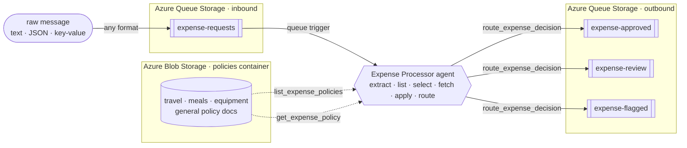

# Serverless Expense Processor Agent [](https://www.python.org/downloads/)

This sample is a **markdown-first serverless agent** built on the
**[Azure Functions Serverless Agents Runtime](https://learn.microsoft.com/azure/azure-functions/functions-serverless-agents-runtime)**
(preview). Its queue trigger and behavior are declared in
[`src/agents/expense_processor.agent.md`](src/agents/expense_processor.agent.md): YAML front matter
connects the trigger, and the Markdown body contains the agent's instructions. Azure Functions handles
execution and scale-to-zero.

Drop an expense or purchase-order request onto a Storage queue in free text, email, key/value, or
JSON. The agent understands the request, selects the applicable spending policy, applies it, and
routes the decision.

**The rules aren't embedded in code.** Finance owns policy documents in Blob Storage, so changing a
document updates how that category is handled without changing or redeploying the application.

Run it locally with Azurite, then deploy it to Azure with `azd up`.

## What it does

- 🧾 **Reads any format:** text, email, key/value, or JSON, and extracts amount, currency, category,
  and vendor.
- 📚 **Picks the right policy:** lists the documents in Blob Storage and selects the one whose scope
  matches, then reads and applies it.
- 🚦 **Routes the decision:** `approve` → `expense-approved`, `review` → `expense-review`,
  `flag` / FX → `expense-flagged`.
- 🔀 **Proves it's reasoning:** the **same $450** is auto-approved as travel but sent to review as a
  client dinner; tighten one policy document and only that category reroutes.

→ Walkthroughs and the proof: [docs/use-cases.md](docs/use-cases.md).

## How it works (the short version)



An Azure Functions app on the serverless agents runtime. The agent is a single markdown file:
[`src/agents/expense_processor.agent.md`](src/agents/expense_processor.agent.md). Its body *is* the
system prompt. Three small custom tools list the policy documents, read the chosen one from Blob
Storage, and write the decision to a queue. All authenticate with the app's **managed identity**.
There are no keys or connection strings. Dependencies are defined in `src/pyproject.toml` and pinned in
`src/uv.lock`; an `azd` hook exports `requirements.txt` for the Functions build at package time.

→ Deeper dives: [How it works](docs/how-it-works.md) · [Use cases](docs/use-cases.md) ·
[Customize](docs/customize.md) · [Deploy](docs/deploy.md) ·
[Troubleshooting](docs/troubleshooting.md)

## Prerequisites

- **[uv](https://docs.astral.sh/uv/):** the one tool for Python here. It manages the version
  (`uv python install 3.13`), the function app's dependencies, and runs the helper scripts.
- **[Azure Developer CLI (`azd`)](https://learn.microsoft.com/azure/developer/azure-developer-cli/install-azd)**
  and **[Azure CLI (`az`)](https://learn.microsoft.com/cli/azure/install-azure-cli)** (signed in with
  `az login`).
- For local runs: **[Azurite](https://learn.microsoft.com/azure/storage/common/storage-use-azurite)**
  and **[Azure Functions Core Tools v4](https://learn.microsoft.com/azure/azure-functions/functions-run-local)**.

**macOS** (all at once):

```bash
curl -LsSf https://astral.sh/uv/install.sh | sh
brew install azure-dev azure-cli azure/functions/azure-functions-core-tools@4
npm install -g azurite
```

**Windows** (PowerShell):

```powershell
powershell -ExecutionPolicy ByPass -c "irm https://astral.sh/uv/install.ps1 | iex"
winget install Microsoft.Azd Microsoft.AzureCLI Microsoft.Azure.FunctionsCoreTools
npm install -g azurite
```

## Quickstart: deploy and watch it decide

```bash
azd auth login
azd up
```

`azd up` provisions the resources, **seeds the policy documents**, deploys the app, and **drops three
`$450` sample requests** on the queue (travel, equipment, a client dinner). Decisions appear with
nothing to run by hand. Read them:

```bash
uv run scripts/read_decision.py --queue all --peek --cloud
```

The reader groups messages into **Approved**, **Needs review**, and **Flagged**, with the selected
policy and reason under each decision. Add `--raw` to print the original JSON payloads.

You'll see the **same $450 routed three different ways**: approved as travel, approved as equipment,
and sent to review as a client dinner because the agent applied a different policy document to each.

Then change one policy and watch only that category reroute, with no redeploy. See
[docs/customize.md](docs/customize.md#swap-a-single-policy). Clean up with `azd down --purge`.

## Run it locally (Azurite)

Local Azurite provides the queues and policy blobs; the agent still calls a model, so set
`AZURE_OPENAI_ENDPOINT` + `AZURE_OPENAI_DEPLOYMENT` in `src/local.settings.json` first (copy it from
[`src/local.settings.json.sample`](src/local.settings.json.sample); leave the API key empty to use
`az login`). `azd provision` once will create a Foundry deployment you can point at.

```bash
azurite --silent --location .azurite               # terminal A
cd src && uv run func start                         # terminal B; uv builds .venv from uv.lock
uv run scripts/send_expense.py --file samples/travel.txt   # terminal C
uv run scripts/read_decision.py --queue all --peek
```

The `uv run` scripts declare their own dependencies inline ([PEP 723](https://peps.python.org/pep-0723/)),
so there's no `pip install` and no virtualenv to manage. uv handles it on first run.

> 🪟 **Windows:** if `uv run func start` fails with `ModuleNotFoundError: azure_functions_agents`, the
> Microsoft Store `python.exe` alias is shadowing the venv. See
> [Troubleshooting → Windows local dev](docs/troubleshooting.md#windows-local-dev).

## Learn more

- [Serverless agents runtime in Azure Functions](https://learn.microsoft.com/azure/azure-functions/functions-serverless-agents-runtime)
- [Azure Functions Flex Consumption](https://learn.microsoft.com/azure/azure-functions/flex-consumption-plan)
- [uv](https://docs.astral.sh/uv/) · [PEP 723: inline script metadata](https://peps.python.org/pep-0723/)

## License

[MIT](LICENSE) © Microsoft Corporation.
