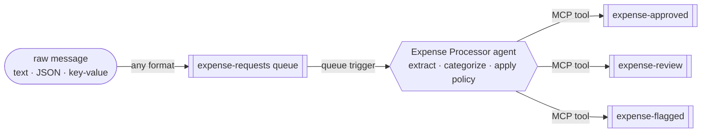

# Serverless Expense Processor Agent

A queue-triggered AI agent built on the **Azure Functions serverless agents runtime** (Microsoft
Agent Framework). Drop an expense or purchase-order request onto a Storage queue — **in whatever
form it arrives: free text, an email snippet, `key: value` lines, or JSON** — and the agent reads
it, extracts the details, applies spending policy, and routes its decision to the right queue.

The dollar amount is the backbone of every decision:

| Amount (USD) | Decision | Routed to queue |
|---|---|---|
| ≤ 100 | `approve` | `expense-approved` |
| > 100 and ≤ 1000 | `route` | `expense-review` |
| > 1000 | `flag` | `expense-flagged` |

On top of the amount, a few policy rules apply judgment: a request with **no clear amount** or a
**cash advance** is always `flagged`, and a **non-USD** amount is `routed` for FX verification (the
agent won't guess an exchange rate).

**Why it's interesting:** the decision isn't a field lookup or an `if/else` on a number. The agent
has to *read* a messy, human-written message, *extract* the amount / currency / category / vendor,
and *reason* over policy. Send the same expense as free text and as JSON — you get the same
decision, because the agent is reasoning, not parsing a fixed schema.

---

## The scenario

Expense and purchase-order requests rarely arrive as clean, validated JSON. They show up as Slack
messages, forwarded emails, quick notes, or half-structured text from a dozen different intake
tools. A traditional function would need a parser for every format and a rules engine for policy.

This sample replaces that with a single **markdown-defined agent**. A message lands on the
`expense-requests` queue and triggers exactly one agent run over that one item. The agent:

1. makes sense of the raw message, whatever its shape,
2. applies a layered spending policy, and
3. routes the outcome to an `approved`, `review`, or `flagged` queue — which a downstream system
   (payments, a human reviewer, a fraud check) can consume.

It runs on **Azure Functions Flex Consumption**, so it scales to zero and costs nothing when the
queue is empty, and it uses a **built-in connector** for the output — no storage SDK code in the
app at all.

---

## How it works



The entire agent is defined declaratively in
**[`src/expense_processor.agent.md`](src/expense_processor.agent.md)** — the front matter wires the
queue trigger, and the markdown body *is* the system prompt. There is no hand-written parsing, no
rules engine, and no storage code; the agent does the work in five steps:

1. **Extract** — pull `amount`, `currency`, `category`, `vendor`, and an `expenseId` out of the raw
   message, wherever and however they appear (`$1,250`, `1.250,00`, and `twelve hundred dollars` all
   describe a number).
2. **Decide** — apply the policy rules below, in order; the first match wins.
3. **Build** — assemble a compact decision JSON.
4. **Route** — call one connector tool to enqueue the decision on the destination queue.
5. **Respond** — return the decision JSON so the outcome is visible in the logs and traces.

### The policy

| # | Condition | Decision | Queue |
|---|---|---|---|
| 1 | No amount can be determined | `flag` | `expense-flagged` |
| 2 | Category is a cash advance | `flag` | `expense-flagged` |
| 3 | Currency is not USD (needs FX verification) | `route` | `expense-review` |
| 4 | Amount ≤ 100 USD | `approve` | `expense-approved` |
| 5 | Amount > 100 and ≤ 1000 USD | `route` | `expense-review` |
| 6 | Amount > 1000 USD | `flag` | `expense-flagged` |

Rules 1–3 are the "judgment" layer that can override the amount. For an ordinary USD expense with a
clear amount, rules 4–6 — the amount alone — decide the outcome.

### A worked example

Send this raw text to the input queue:

> Grabbed lunch for the team at Olive Garden after the sprint review, came to $45 even. — Nick

The agent extracts the details and produces:

```json
{ "expenseId": "EXP-3F8A1C", "vendor": "Olive Garden", "category": "meals", "amount": 45.0, "currency": "USD", "decision": "approve", "routedTo": "expense-approved", "reason": "Meals expense of 45 USD is at or below the 100 auto-approve threshold." }
```

…and puts it on the `expense-approved` queue. By contrast, a `$50 cash advance` is **flagged**
(policy beats the amount), `480 EUR` is **routed** for FX review, and a message with no number is
**flagged** for clarification — all from the same agent, driven by what it reads.

### Routing: a connector, not code

The agent routes each decision by calling the **Azure Queues connector** as an MCP tool — a built-in
*Put a message on a queue* action exposed to the agent. There is **no SDK routing code** in the app;
the whole output path is a one-time-authorized connector.

The connector authenticates with **delegated OAuth**: you sign the connection in once (see
[Deploy](#deploy-to-azure)) and it writes as that Entra identity. The storage account has
**shared-key access disabled** (`allowSharedKeyAccess: false`), so this token-based path is the
compliant, secret-free way to write — no keys, no connection strings.

> **Where routing happens.** The routing connector is configured in Azure. Anywhere the connector
> isn't present, the agent still runs and *returns* the decision JSON — it just doesn't enqueue it.
> In the deployed app, the decision lands in the correct queue.

---

## What gets deployed

`azd up` provisions everything in [`infra/`](infra/) and deploys the app:

- **Function App** — Flex Consumption, Python 3.13, running the agent
- **Microsoft Foundry** account + project + a `gpt-5.4` model deployment
- **Storage account** — the `expense-requests` input queue and the `expense-approved` /
  `expense-review` / `expense-flagged` output queues
- **User-assigned managed identity** + RBAC — Storage Queue Data Contributor (so the trigger can
  read the input queue), Foundry access, and an access policy on the connector so the app can invoke
  the routing tool
- **Connectors Namespace** (`Microsoft.Web/connectorGateways`) exposing the built-in **Azure Queues**
  connector used for routing

Key values are printed as `azd` outputs and saved to `.azure/<env>/.env` (for example
`OUTPUT_STORAGE_ACCOUNT`, `QUEUE_MCP_SERVER_URL`, `ROUTE_QUEUE_CONNECTION_NAME`,
`CONNECTOR_GATEWAY_NAME`).

---

## Repo layout

```
src/
  expense_processor.agent.md   # the agent: extract -> apply policy -> route (the star of the show)
  mcp.json                     # registers the Azure Queues routing MCP server
  function_app.py              # entry point + a small runtime compatibility shim (see below)
  agents.config.yaml           # runtime defaults (timeout)
  host.json                    # queue messageEncoding + logging config
  requirements.txt             # function app dependencies (just the runtime — no storage SDK)
  local.settings.json.sample   # app settings reference
infra/                         # azd / Bicep: Functions, Foundry, storage+queues, Queues connector, RBAC
scripts/
  send_expense.py              # enqueue a request against the deployed account (Entra ID / --cloud)
  read_decision.py             # read decisions from the output queues (--cloud)
  _cloud.py                    # shared helper: resolves the deployed account from the azd env
  requirements.txt             # dependencies for the helper scripts
samples/                       # varied formats: text, JSON, EUR, cash advance, missing amount
azure.yaml                     # azd service definition
```

---

## Deploy to Azure

### Prerequisites

- An **Azure subscription** with permission to create Functions, Storage, Microsoft Foundry, and a
  connector gateway
- [Azure Developer CLI](https://learn.microsoft.com/azure/developer/azure-developer-cli/install-azd) (`azd`)
- [Azure CLI](https://learn.microsoft.com/cli/azure/install-azure-cli) (`az`) — signed in with `az login`
- [Python 3.8+](https://www.python.org/downloads/) — only for the `scripts/` send/read helpers (you
  can use the `az` CLI instead)

### 1. Provision and deploy

```bash
azd auth login
azd up
```

`azd up` provisions the resources listed in [What gets deployed](#what-gets-deployed) and deploys the
app. It prompts for an environment name, subscription, and region on first run.

### 2. Authorize the routing connection (one-time)

Routing writes through the Azure Queues connector, which uses delegated OAuth — so the connection
needs a single interactive sign-in (it can't be automated):

1. Go to **[connectors.azure.com](https://connectors.azure.com)** → open the `cg-*` gateway → the
   **`queue-route`** connection → **Authorize**.
2. Sign in with an account that holds **Storage Queue Data Message Sender** (or Contributor) on the
   storage account. `azd` already grants that role to whoever ran the deploy, so signing in as
   yourself works.

The connection flips from `Unauthenticated` to authorized and the agent starts enqueuing decisions.
Until then the agent still runs and returns the decision JSON, but nothing lands in the output queues.

### 3. Send a request and read the decision

The helper scripts talk to the deployed account over **Entra ID** (no keys). The `--cloud` flag
auto-resolves the account from your `azd` env:

```bash
# One-time: grant your own identity the queue roles (send to input, read outputs)
ACCT=$(azd env get-value OUTPUT_STORAGE_ACCOUNT)
ME=$(az ad signed-in-user show --query id -o tsv)
SCOPE=$(az storage account show -n "$ACCT" --query id -o tsv)
az role assignment create --assignee "$ME" --scope "$SCOPE" --role "Storage Queue Data Message Sender"
az role assignment create --assignee "$ME" --scope "$SCOPE" --role "Storage Queue Data Message Processor"

# Install the helper-script deps once
pip install -r scripts/requirements.txt

# Send a few requests in different formats
python scripts/send_expense.py --file samples/approve.txt          --cloud   # text -> approve
python scripts/send_expense.py --file samples/cash-advance.txt     --cloud   # $50  -> flag (policy)
python scripts/send_expense.py --file samples/foreign-currency.txt --cloud   # EUR  -> route (FX)
python scripts/send_expense.py "lunch with the team ran about $45" --cloud   # inline text -> approve

# Wait ~60–90s for the agent + connector, then peek all three decision queues
python scripts/read_decision.py --queue all --peek --cloud
```

Change the amount (or the wording) and watch the decision follow. Prefer the `az` CLI directly? The
scripts are only a convenience:

```bash
az storage message put  --account-name "$ACCT" --queue-name expense-requests \
  --content "Team lunch at Olive Garden, about \$45" --auth-mode login
az storage message peek --account-name "$ACCT" --queue-name expense-approved --auth-mode login
```

---

## Under the hood: message encoding

The project sends **raw text** (not base64) so messages are human-readable in the portal and via
`az storage message put`. Three settings make that work end to end:

- `host.json` → `extensions.queues.messageEncoding: "none"` — the host passes the queue text through
  unchanged.
- The agent trigger sets `data_type: string`.
- `src/function_app.py` installs a small **compatibility shim**: the Azure Functions Python worker
  hands the trigger a `QueueMessage` binding object, which the runtime would otherwise stringify to
  `<azure.QueueMessage …>`. The shim pulls the real body out of any binding object that exposes
  `get_body()` (queues, Service Bus, Event Hubs), so the agent sees the actual message text.

---

## Troubleshooting

- **Output queues stay empty** → the `queue-route` connection isn't authorized yet. Authorize it at
  [connectors.azure.com](https://connectors.azure.com) (see
  [step 2](#2-authorize-the-routing-connection-one-time)). Also confirm the app deployed and check
  the function logs / Application Insights for the agent run and any routing-tool error.
- **`403` from the scripts against the account** → you're missing the Storage Queue data roles;
  grant *Message Sender* (send) and *Message Processor* or *Data Reader* (read). RBAC can take a few
  minutes to propagate.
- **`DeploymentNotFound` / model errors** → the Foundry model deployment isn't ready or the app
  settings don't point at it; check the `azd` outputs and the Function App configuration.

---

## License

[MIT](LICENSE) © Microsoft Corporation.
