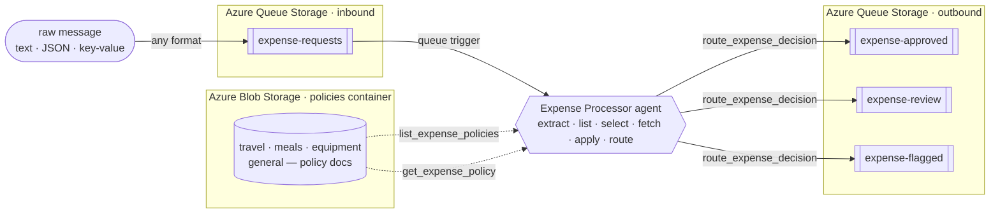

# Serverless Expense Processor Agent

A queue-triggered AI agent built on the **Azure Functions serverless agents runtime** (Microsoft
Agent Framework). Drop an expense or purchase-order request onto a Storage queue — **in whatever
form it arrives: free text, an email snippet, `key: value` lines, or JSON** — and the agent reads
it, **works out which spending policy applies, fetches that policy, applies it, and routes its
decision** to the right queue.

The rules aren't baked into the code, and there isn't just one set of them. Finance owns a **library
of policy documents in Blob Storage** — a general policy plus category-specific ones — and the agent
**picks the one that governs each request** before it decides:

| Policy document | Applies to | Auto-approve ≤ | Review band | Flag > |
|---|---|---|---|---|
| `travel-policy.md` | flights, hotels, rail, taxis, car rental, mileage | **$1,000** | $1,000 – $5,000 | $5,000 |
| `meals-entertainment-policy.md` | meals, team lunches/dinners, catering, client entertainment | **$150** | $150 – $1,000 | $1,000 |
| `equipment-software-policy.md` | laptops, monitors, peripherals, software, subscriptions | **$500** | $500 – $2,500 | $2,500 |
| `general-expense-policy.md` | anything the specific policies don't cover (fallback) | **$100** | $100 – $1,000 | $1,000 |

Each policy also applies judgment on top of the amount — a **cash advance** or a request with **no
clear amount** is `flagged`, a **non-USD** amount is `routed` for FX verification (the agent won't
guess a rate), and category quirks like **client entertainment** or **premium travel** always get a
human look.

**Why it's a good fit for an agent:** the decision isn't a field lookup or an `if/else` on a number —
it's *retrieval + selection + reasoning*. The agent reads a messy, human-written message, extracts
the amount / currency / category / vendor, **chooses the right policy from several**, reads that
natural-language document, and reasons over the two together. Two things prove it's genuinely
reasoning rather than matching a fixed schema:

- The **same $450** is **auto-approved as travel**, but **routed for review as a client dinner** —
  because the agent applies a *different policy* to each. The category drives which thresholds apply.
- **Swap one category's policy document** — tighten travel, say — and only **travel** requests
  reroute; meals and equipment are untouched. No code change, no redeploy. The rules live in the
  documents, and the agent applies whichever one it selects.

---

## The scenario

Expense and purchase-order requests rarely arrive as clean, validated JSON. They show up as Slack
messages, forwarded emails, quick notes, or half-structured text from a dozen different intake
tools — and a real finance org doesn't run every one through the *same* rulebook. Travel, meals,
and capital equipment each have their own thresholds and their own exceptions. A traditional
function would need a parser for every format and a rules engine that encodes every policy.

This sample replaces that with a single **markdown-defined agent**. A message lands on the
`expense-requests` queue and triggers exactly one agent run over that one item. The agent:

1. makes sense of the raw message, whatever its shape, and works out the category,
2. **lists the available policies** and **selects the one whose scope matches** the expense,
3. **fetches that policy document** from Blob Storage and applies it, and
4. routes the outcome to an `approved`, `review`, or `flagged` queue — which a downstream system
   (payments, a human reviewer, a fraud check) can consume.

Because the policies are **documents the agent reads at runtime** — and it *chooses among them* — the
people who own spending policy can change how a whole category is triaged, or add a brand-new policy,
by editing files. No engineer, no deploy. That's the difference between a rules engine and an agent:
the agent retrieves the right natural-language policy and applies it to each unique request.

It runs on **Azure Functions Flex Consumption**, so it scales to zero and costs nothing when the
queue is empty, and it reads the policies and routes each decision with small **custom tools** that
use the app's **managed identity** — no keys, no connection strings.

---

## How it works



The entire agent is defined declaratively in
**[`src/expense_processor.agent.md`](src/expense_processor.agent.md)** — the front matter wires the
queue trigger, and the markdown body *is* the system prompt. There is no hand-written parsing and no
rules engine; the agent does the work in eight steps:

1. **Extract** — pull `amount`, `currency`, `category`, `vendor`, and an `expenseId` out of the raw
   message, wherever and however they appear (`$1,250`, `1.250,00`, and `twelve hundred dollars` all
   describe a number).
2. **List** — call the `list_expense_policies` tool to see which policy documents exist and what each
   one covers.
3. **Select** — choose the single policy whose scope matches the expense category (or the general
   policy when nothing else fits).
4. **Fetch** — call the `get_expense_policy` tool with that document's name to read its full text (a
   fresh read every request, so policy edits take effect immediately).
5. **Decide** — apply the policy it just fetched, in order; the first matching rule wins.
6. **Build** — assemble a compact decision JSON, including `policyApplied` so the chosen policy is
   visible.
7. **Route** — call the `route_expense_decision` tool to enqueue the decision on the destination
   queue.
8. **Respond** — return the decision JSON so the outcome is visible in the logs and traces.

### The policies live in documents — and the agent picks one

The rules come from a set of markdown documents in the **[`src/policies/`](src/policies/)** folder,
stored as blobs in the `policies` container on the same storage account as the queues. The bundled
documents are **seeded automatically on first run**, so a fresh deploy works out of the box. Each
document starts with an `**Applies to:**` line that the `list_expense_policies` tool surfaces as the
policy's scope, which is how the agent knows which one to fetch.

Because every policy sets its **own** thresholds, the category the agent picks changes the outcome.
Here's the **same $450 request** run through each category:

| $450 request | Category → policy | Auto-approve ≤ | Decision |
|---|---|---|---|
| Round-trip flight to Denver | travel → `travel-policy.md` | $1,000 | **`approve`** |
| 4K monitor from Dell | equipment → `equipment-software-policy.md` | $500 | **`approve`** |
| Client dinner at Nobu | meals → `meals-entertainment-policy.md` | $150 (client entertainment always reviews) | **`review`** |
| Uncategorized purchase | fallback → `general-expense-policy.md` | $100 | **`review`** |

Same dollar amount, four documents, different outcomes — driven by *which policy the agent selects*,
not by logic compiled into the prompt.

And because each category is its **own** document, you can change one without touching the others.
Swap in the stricter travel policy bundled at
[`samples/strict-travel-policy.md`](samples/strict-travel-policy.md) (travel auto-approve drops from
$1,000 to **$250**) and the **$450 flight flips from `approve` to `review`** — while the $450 monitor
and the $450 client dinner are **completely unaffected**:

```bash
# tighten ONLY travel — meals, equipment, and general are untouched
python scripts/set_policy.py --file samples/strict-travel-policy.md --name travel-policy.md --cloud
```

This is the heart of the sample: the dollar amount still drives the decision, but *which* policy —
and therefore *which* thresholds — applies is data the agent retrieves and reasons over.

### A worked example

Send this raw text to the input queue:

> Booked a $450 round-trip flight to Denver for the customer onsite next week. — Priya

The agent extracts the details, selects the travel policy, applies it, and produces:

```json
{ "expenseId": "EXP-3F8A1C", "vendor": "United Airlines", "category": "travel", "amount": 450.0, "currency": "USD", "policyApplied": "travel-policy.md", "decision": "approve", "routedTo": "expense-approved", "reason": "Travel expense of 450 USD is at or below the travel policy's 1,000 auto-approve threshold." }
```

…and puts it on the `expense-approved` queue. Send the *same* $450 as a **client dinner** and it's
**routed for review** under `meals-entertainment-policy.md` instead — same amount, different policy,
different queue. A `$50 cash advance` is **flagged**, `480 EUR` is **routed** for FX review, and a
message with no number is **flagged** for clarification — all from the same agent, driven by what it
selects and reads.

### Managed identity, not keys

The agent touches storage through three custom tools, and **all authenticate with the Function app's
user-assigned managed identity** (`DefaultAzureCredential`) — the same identity the trigger uses:

- **[`list_expense_policies`](src/tools/list_policies.py)** lists the policy documents and their
  scopes from Blob Storage.
- **[`get_expense_policy`](src/tools/get_policy.py)** reads one chosen policy document from Blob
  Storage.
- **[`route_expense_decision`](src/tools/route_decision.py)** writes the decision to the destination
  queue with the Azure Queue Storage SDK.

That identity holds **Storage Blob Data** and **Storage Queue Data Contributor** roles on the account,
so reads and writes need **no keys and no connection strings**. The account keeps **shared-key access
disabled** (`allowSharedKeyAccess: false`), and the tools still work because every call is
Entra-authenticated.

> Locally the same tools use the Azurite development connection string for both the policy blobs and
> the queues, so the agent behaves identically end to end without any cloud dependency.

---

## What gets deployed

`azd up` provisions everything in [`infra/`](infra/) and deploys the app:

- **Function App** — Flex Consumption, Python 3.13, running the agent
- **Microsoft Foundry** account + project + a `gpt-5.4` model deployment
- **Storage account** — the `expense-requests` input queue, the `expense-approved` /
  `expense-review` / `expense-flagged` output queues, and a `policies` blob container that holds the
  approval policy documents
- **User-assigned managed identity** + RBAC — **Storage Queue Data Contributor** and **Storage Blob
  Data** access on the storage account (the trigger reads the input queue; `route_expense_decision`
  writes the output queues; the policy tools list and read the policy blobs) plus Foundry access. The
  deploying user is also granted **Storage Queue Data Contributor** and **Storage Blob Data
  Contributor** so the demo scripts can send requests, read decisions, and change policies out of
  the box.

Key values are printed as `azd` outputs and saved to `.azure/<env>/.env` (for example
`OUTPUT_STORAGE_ACCOUNT`, `AZURE_FUNCTION_NAME`, and `INPUT_QUEUE_NAME`).

---

## Repo layout

```
src/
  expense_processor.agent.md   # the agent: extract -> list -> select -> fetch -> apply -> route (the star of the show)
  policies/                    # the policy library, seeded to Blob Storage on first run
    general-expense-policy.md  #   fallback / catch-all (also the POLICY_BLOB default)
    travel-policy.md           #   flights, hotels, rail, taxis, car rental, mileage
    meals-entertainment-policy.md  # meals, catering, client entertainment
    equipment-software-policy.md   # hardware, software, subscriptions
  tools/
    list_policies.py           # custom tool: lists the policy documents + scopes (managed identity)
    get_policy.py              # custom tool: reads one chosen policy document (managed identity)
    route_decision.py          # custom tool: writes the decision to a queue (managed identity)
    _policy_store.py           # shared blob-storage helpers for the two policy tools (not a tool itself)
  function_app.py              # entry point + a small runtime compatibility shim (see below)
  agents.config.yaml           # runtime defaults (timeout)
  host.json                    # queue messageEncoding + logging config
  requirements.txt             # function app dependencies (runtime + Azure Storage SDKs)
  local.settings.json.sample   # app settings reference
infra/                         # azd / Bicep: Functions, Foundry, storage (queues + policies blob), identity, RBAC
scripts/
  send_expense.py              # enqueue a request against the deployed account (Entra ID / --cloud)
  read_decision.py             # read decisions from the output queues (--cloud)
  set_policy.py                # list / show / seed / replace policy documents (--cloud)
  _cloud.py                    # shared helper: resolves the deployed account from the azd env
  requirements.txt             # dependencies for the helper scripts
samples/                       # varied formats + the $450-per-category set + a stricter travel policy for the swap demo
azure.yaml                     # azd service definition
```

---

## Deploy to Azure

### Prerequisites

- An **Azure subscription** with permission to create Functions, Storage, and Microsoft Foundry
  resources
- [Azure Developer CLI](https://learn.microsoft.com/azure/developer/azure-developer-cli/install-azd) (`azd`)
- [Azure CLI](https://learn.microsoft.com/cli/azure/install-azure-cli) (`az`) — signed in with `az login`
- [Python 3.8+](https://www.python.org/downloads/) — only for the `scripts/` send/read helpers (you
  can use the `az` CLI instead)

### 1. Provision and deploy

```bash
azd auth login
azd up
```

`azd up` provisions the resources listed in [What gets deployed](#what-gets-deployed) and deploys the
app. It prompts for an environment name, subscription, and region on first run.

### 2. Send a request and read the decision

The helper scripts talk to the deployed account over **Entra ID** (no keys). `azd` already granted
your identity **Storage Queue Data Contributor** and **Storage Blob Data Contributor** on the storage
account during deploy, so you can send, read, and change policies right away. The `--cloud` flag
auto-resolves the account from your `azd` env:

```bash
# Install the helper-script deps once
pip install -r scripts/requirements.txt

# The same $450, three categories -> three different policies
python scripts/send_expense.py --file samples/travel.txt       --cloud   # $450 flight   -> approve (travel)
python scripts/send_expense.py --file samples/equipment.txt     --cloud   # $450 monitor  -> approve (equipment)
python scripts/send_expense.py --file samples/client-dinner.txt --cloud   # $450 dinner   -> review  (meals)

# Wait ~30–60s for the agent to run, then peek all three decision queues
python scripts/read_decision.py --queue all --peek --cloud
```

Each decision carries a `policyApplied` field naming the document the agent selected. Prefer the `az`
CLI directly? The scripts are only a convenience:

```bash
ACCT=$(azd env get-value OUTPUT_STORAGE_ACCOUNT)
az storage message put  --account-name "$ACCT" --queue-name expense-requests \
  --content "Booked a \$450 round-trip flight to Denver" --auth-mode login
az storage message peek --account-name "$ACCT" --queue-name expense-approved --auth-mode login
```

### 3. Change one policy, not the code

The most telling part of the demo: replace a **single** category's policy and only that category
reroutes — no redeploy. The bundled `samples/strict-travel-policy.md` drops travel auto-approve to
$250.

```bash
# List the policies in effect, then baseline: the $450 flight auto-approves
python scripts/set_policy.py --list --cloud
python scripts/send_expense.py --file samples/travel.txt --cloud
python scripts/read_decision.py --queue expense-approved --peek --cloud

# Tighten ONLY travel — swap the travel document, leave meals/equipment/general alone
python scripts/set_policy.py --file samples/strict-travel-policy.md --name travel-policy.md --cloud

# Same $450 flight is now routed for review; the $450 monitor still auto-approves
python scripts/send_expense.py --file samples/travel.txt   --cloud
python scripts/send_expense.py --file samples/equipment.txt --cloud
python scripts/read_decision.py --queue all --peek --cloud

# Restore the shipped travel policy (or re-seed the whole library) when you're done
python scripts/set_policy.py --file src/policies/travel-policy.md --cloud
python scripts/set_policy.py --seed --cloud
```

---

## Under the hood: message encoding

The project sends **raw text** (not base64) so messages are human-readable in the portal and via
`az storage message put`. Three settings make that work end to end:

- `host.json` → `extensions.queues.messageEncoding: "none"` — the host passes the queue text through
  unchanged.
- The agent trigger sets `data_type: string`.
- `src/function_app.py` installs a small **compatibility shim**: the Azure Functions Python worker
  hands the trigger a `QueueMessage` binding object, which the runtime would otherwise stringify to
  `<azure.QueueMessage …>`. The shim pulls the real body out of any binding object that exposes
  `get_body()` (queues, Service Bus, Event Hubs), so the agent sees the actual message text.

---

## Troubleshooting

- **Output queues stay empty** → check the function logs / Application Insights for the agent run and
  any `route_expense_decision` error. Confirm the app deployed and that the managed identity has
  **Storage Queue Data Contributor** on the storage account (RBAC can take a few minutes to propagate
  after deploy).
- **`403` from the scripts against the account** → your identity is missing **Storage Queue Data
  Contributor** (send/read) or **Storage Blob Data Contributor** (policies) on the account. `azd`
  grants both to the deployer, but role propagation can take a few minutes.
- **Policy changes don't seem to take effect** → confirm what's in effect with
  `python scripts/set_policy.py --list --cloud`, then send a *new* request (policies are read per
  request, so messages already processed keep their original decision). Remember the agent selects by
  category — swapping `travel-policy.md` only affects travel requests.
- **`DeploymentNotFound` / model errors** → the Foundry model deployment isn't ready or the app
  settings don't point at it; check the `azd` outputs and the Function App configuration.

---

## License

[MIT](LICENSE) © Microsoft Corporation.
