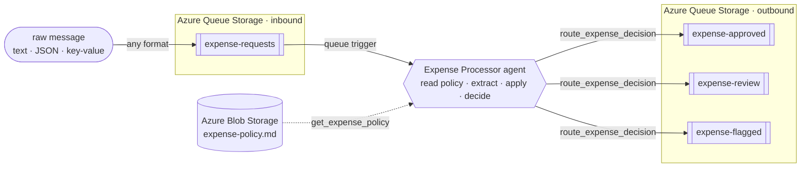

# Serverless Expense Processor Agent

A queue-triggered AI agent built on the **Azure Functions serverless agents runtime** (Microsoft
Agent Framework). Drop an expense or purchase-order request onto a Storage queue — **in whatever
form it arrives: free text, an email snippet, `key: value` lines, or JSON** — and the agent reads
it, **fetches the current spending policy**, extracts the details, applies that policy, and routes
its decision to the right queue.

The rules aren't baked into the code. The agent reads them at decision time from a **policy
document that lives in Blob Storage** — the kind of document Finance actually owns:

| Amount (USD) | Decision | Routed to queue |
|---|---|---|
| ≤ 100 | `approve` | `expense-approved` |
| > 100 and ≤ 1000 | `route` | `expense-review` |
| > 1000 | `flag` | `expense-flagged` |

On top of the amount, the policy applies judgment: a request with **no clear amount** or a **cash
advance** is always `flagged`, and a **non-USD** amount is `routed` for FX verification (the agent
won't guess an exchange rate).

**Why it's a good fit for an agent:** the decision isn't a field lookup or an `if/else` on a number.
The agent has to *read* a messy, human-written message, *extract* the amount / currency / category /
vendor, *read a natural-language policy*, and *reason* over the two together. Two things prove it's
genuinely reasoning rather than parsing a fixed schema:

- Send the **same expense** as free text and as JSON — you get the **same decision**.
- **Edit the policy document** — lower the auto-approve threshold, say — and the **same expense**
  gets routed differently, with **no code change and no redeploy**. The rules live in the document,
  and the agent applies whatever it reads.

---

## The scenario

Expense and purchase-order requests rarely arrive as clean, validated JSON. They show up as Slack
messages, forwarded emails, quick notes, or half-structured text from a dozen different intake
tools. A traditional function would need a parser for every format and a rules engine for policy.

This sample replaces that with a single **markdown-defined agent**. A message lands on the
`expense-requests` queue and triggers exactly one agent run over that one item. The agent:

1. reads the current spending policy from a document in Blob Storage,
2. makes sense of the raw message, whatever its shape,
3. applies the policy it just read, and
4. routes the outcome to an `approved`, `review`, or `flagged` queue — which a downstream system
   (payments, a human reviewer, a fraud check) can consume.

Because the policy is a **document the agent reads at runtime** rather than rules compiled into the
prompt, the people who own spending policy can change how requests are triaged by editing a file —
no engineer, no deploy. That's the difference between a rules engine and an agent: the agent
interprets a natural-language policy and applies it to each unique request.

It runs on **Azure Functions Flex Consumption**, so it scales to zero and costs nothing when the
queue is empty, and it reads the policy and routes each decision with small **custom tools** that
use the app's **managed identity** — no keys, no connection strings.

---

## How it works



The entire agent is defined declaratively in
**[`src/expense_processor.agent.md`](src/expense_processor.agent.md)** — the front matter wires the
queue trigger, and the markdown body *is* the system prompt. There is no hand-written parsing and no
rules engine; the agent does the work in six steps:

1. **Fetch policy** — call the `get_expense_policy` tool to read the current approval policy from
   Blob Storage (a fresh read on every request, so policy edits take effect immediately).
2. **Extract** — pull `amount`, `currency`, `category`, `vendor`, and an `expenseId` out of the raw
   message, wherever and however they appear (`$1,250`, `1.250,00`, and `twelve hundred dollars` all
   describe a number).
3. **Decide** — apply the policy it just read, in order; the first match wins.
4. **Build** — assemble a compact decision JSON.
5. **Route** — call the `route_expense_decision` tool to enqueue the decision on the destination
   queue.
6. **Respond** — return the decision JSON so the outcome is visible in the logs and traces.

### The policy lives in a document

The rules the agent applies come from **[`src/policies/expense-policy.md`](src/policies/expense-policy.md)**,
which is stored as a blob (`policies/expense-policy.md`) in the same storage account as the queues.
The bundled document is seeded automatically on first run, so a fresh deploy works out of the box.

| # | Condition | Decision | Queue |
|---|---|---|---|
| 1 | No amount can be determined | `flag` | `expense-flagged` |
| 2 | Category is a cash advance | `flag` | `expense-flagged` |
| 3 | Currency is not USD (needs FX verification) | `route` | `expense-review` |
| 4 | Amount ≤ 100 USD | `approve` | `expense-approved` |
| 5 | Amount > 100 and ≤ 1000 USD | `route` | `expense-review` |
| 6 | Amount > 1000 USD | `flag` | `expense-flagged` |

Rules 1–3 are the "judgment" layer that can override the amount. For an ordinary USD expense with a
clear amount, rules 4–6 — the amount alone — decide the outcome.

Because the agent reads this document every time, **changing it changes the behavior with no
redeploy**. Swap in the stricter policy bundled at
[`samples/strict-policy.md`](samples/strict-policy.md) (auto-approve drops to $25) and the same $45
lunch that was auto-approved is now routed for review:

```bash
# same message, two different policies -> two different decisions
python scripts/set_policy.py --file src/policies/expense-policy.md --cloud   # default: $45 -> approve
python scripts/set_policy.py --file samples/strict-policy.md      --cloud   # strict:  $45 -> review
```

This is the heart of the sample: the dollar amount still drives the decision, but *which* thresholds
apply is data the agent reads — not logic it has compiled in.

### A worked example

Send this raw text to the input queue:

> Grabbed lunch for the team at Olive Garden after the sprint review, came to $45 even. — Nick

The agent extracts the details and produces:

```json
{ "expenseId": "EXP-3F8A1C", "vendor": "Olive Garden", "category": "meals", "amount": 45.0, "currency": "USD", "decision": "approve", "routedTo": "expense-approved", "reason": "Meals expense of 45 USD is at or below the policy's 100 auto-approve threshold." }
```

…and puts it on the `expense-approved` queue. By contrast, a `$50 cash advance` is **flagged**
(policy beats the amount), `480 EUR` is **routed** for FX review, and a message with no number is
**flagged** for clarification — all from the same agent, driven by what it reads.

### Managed identity, not keys

The agent touches storage through two custom tools, and **both authenticate with the Function app's
user-assigned managed identity** (`DefaultAzureCredential`) — the same identity the trigger uses:

- **[`get_expense_policy`](src/tools/get_policy.py)** reads the policy document from Blob Storage.
- **[`route_expense_decision`](src/tools/route_decision.py)** writes the decision to the destination
  queue with the Azure Queue Storage SDK.

That identity holds **Storage Blob Data** and **Storage Queue Data Contributor** roles on the account,
so reads and writes need **no keys and no connection strings**. The account keeps **shared-key access
disabled** (`allowSharedKeyAccess: false`), and the tools still work because every call is
Entra-authenticated.

> Locally the same tools use the Azurite development connection string for both the policy blob and
> the queues, so the agent behaves identically end to end without any cloud dependency.

---

## What gets deployed

`azd up` provisions everything in [`infra/`](infra/) and deploys the app:

- **Function App** — Flex Consumption, Python 3.13, running the agent
- **Microsoft Foundry** account + project + a `gpt-5.4` model deployment
- **Storage account** — the `expense-requests` input queue, the `expense-approved` /
  `expense-review` / `expense-flagged` output queues, and a `policies` blob container that holds the
  approval policy document
- **User-assigned managed identity** + RBAC — **Storage Queue Data Contributor** and **Storage Blob
  Data** access on the storage account (the trigger reads the input queue; `route_expense_decision`
  writes the output queues; `get_expense_policy` reads the policy blob) plus Foundry access. The
  deploying user is also granted **Storage Queue Data Contributor** and **Storage Blob Data
  Contributor** so the demo scripts can send requests, read decisions, and change the policy out of
  the box.

Key values are printed as `azd` outputs and saved to `.azure/<env>/.env` (for example
`OUTPUT_STORAGE_ACCOUNT`, `AZURE_FUNCTION_NAME`, and `INPUT_QUEUE_NAME`).

---

## Repo layout

```
src/
  expense_processor.agent.md   # the agent: fetch policy -> extract -> apply -> route (the star of the show)
  policies/
    expense-policy.md          # the approval policy the agent reads (seeded to Blob Storage on first run)
  tools/
    get_policy.py              # custom tool: reads the policy document via managed identity
    route_decision.py          # custom tool: writes the decision to a queue via managed identity
  function_app.py              # entry point + a small runtime compatibility shim (see below)
  agents.config.yaml           # runtime defaults (timeout)
  host.json                    # queue messageEncoding + logging config
  requirements.txt             # function app dependencies (runtime + Azure Storage SDKs)
  local.settings.json.sample   # app settings reference
infra/                         # azd / Bicep: Functions, Foundry, storage (queues + policy blob), identity, RBAC
scripts/
  send_expense.py              # enqueue a request against the deployed account (Entra ID / --cloud)
  read_decision.py             # read decisions from the output queues (--cloud)
  set_policy.py                # show or replace the policy document (--cloud)
  _cloud.py                    # shared helper: resolves the deployed account from the azd env
  requirements.txt             # dependencies for the helper scripts
samples/                       # varied formats: text, JSON, EUR, cash advance, missing amount, + a strict policy
azure.yaml                     # azd service definition
```

---

## Deploy to Azure

### Prerequisites

- An **Azure subscription** with permission to create Functions, Storage, and Microsoft Foundry
  resources
- [Azure Developer CLI](https://learn.microsoft.com/azure/developer/azure-developer-cli/install-azd) (`azd`)
- [Azure CLI](https://learn.microsoft.com/cli/azure/install-azure-cli) (`az`) — signed in with `az login`
- [Python 3.8+](https://www.python.org/downloads/) — only for the `scripts/` send/read helpers (you
  can use the `az` CLI instead)

### 1. Provision and deploy

```bash
azd auth login
azd up
```

`azd up` provisions the resources listed in [What gets deployed](#what-gets-deployed) and deploys the
app. It prompts for an environment name, subscription, and region on first run.

### 2. Send a request and read the decision

The helper scripts talk to the deployed account over **Entra ID** (no keys). `azd` already granted
your identity **Storage Queue Data Contributor** and **Storage Blob Data Contributor** on the storage
account during deploy, so you can send, read, and change the policy right away. The `--cloud` flag
auto-resolves the account from your `azd` env:

```bash
# Install the helper-script deps once
pip install -r scripts/requirements.txt

# Send a few requests in different formats
python scripts/send_expense.py --file samples/approve.txt          --cloud   # text -> approve
python scripts/send_expense.py --file samples/cash-advance.txt     --cloud   # $50  -> flag (policy)
python scripts/send_expense.py --file samples/foreign-currency.txt --cloud   # EUR  -> route (FX)
python scripts/send_expense.py "lunch with the team ran about $45" --cloud   # inline text -> approve

# Wait ~30–60s for the agent to run, then peek all three decision queues
python scripts/read_decision.py --queue all --peek --cloud
```

Change the amount (or the wording) and watch the decision follow. Prefer the `az` CLI directly? The
scripts are only a convenience:

```bash
ACCT=$(azd env get-value OUTPUT_STORAGE_ACCOUNT)
az storage message put  --account-name "$ACCT" --queue-name expense-requests \
  --content "Team lunch at Olive Garden, about \$45" --auth-mode login
az storage message peek --account-name "$ACCT" --queue-name expense-approved --auth-mode login
```

### 3. Change the policy, not the code

The most telling part of the demo: edit the policy document and the **same** request routes
differently, with no redeploy. The bundled `samples/strict-policy.md` drops the auto-approve
threshold to $25.

```bash
# Baseline: $45 lunch is auto-approved under the default policy
python scripts/send_expense.py --file samples/approve.txt --cloud
python scripts/read_decision.py --queue expense-approved --peek --cloud

# Swap in the stricter policy — no code change, no redeploy
python scripts/set_policy.py --file samples/strict-policy.md --cloud

# Same $45 lunch is now routed for review instead
python scripts/send_expense.py --file samples/approve.txt --cloud
python scripts/read_decision.py --queue expense-review --peek --cloud

# Show what's in effect, and restore the default when you're done
python scripts/set_policy.py --show --cloud
python scripts/set_policy.py --file src/policies/expense-policy.md --cloud
```

---

## Under the hood: message encoding

The project sends **raw text** (not base64) so messages are human-readable in the portal and via
`az storage message put`. Three settings make that work end to end:

- `host.json` → `extensions.queues.messageEncoding: "none"` — the host passes the queue text through
  unchanged.
- The agent trigger sets `data_type: string`.
- `src/function_app.py` installs a small **compatibility shim**: the Azure Functions Python worker
  hands the trigger a `QueueMessage` binding object, which the runtime would otherwise stringify to
  `<azure.QueueMessage …>`. The shim pulls the real body out of any binding object that exposes
  `get_body()` (queues, Service Bus, Event Hubs), so the agent sees the actual message text.

---

## Troubleshooting

- **Output queues stay empty** → check the function logs / Application Insights for the agent run and
  any `route_expense_decision` error. Confirm the app deployed and that the managed identity has
  **Storage Queue Data Contributor** on the storage account (RBAC can take a few minutes to propagate
  after deploy).
- **`403` from the scripts against the account** → your identity is missing **Storage Queue Data
  Contributor** (send/read) or **Storage Blob Data Contributor** (policy) on the account. `azd`
  grants both to the deployer, but role propagation can take a few minutes.
- **Policy changes don't seem to take effect** → confirm the upload succeeded with
  `python scripts/set_policy.py --show --cloud`, then send a *new* request (the policy is read per
  request, so messages already processed keep their original decision).
- **`DeploymentNotFound` / model errors** → the Foundry model deployment isn't ready or the app
  settings don't point at it; check the `azd` outputs and the Function App configuration.

---

## License

[MIT](LICENSE) © Microsoft Corporation.
