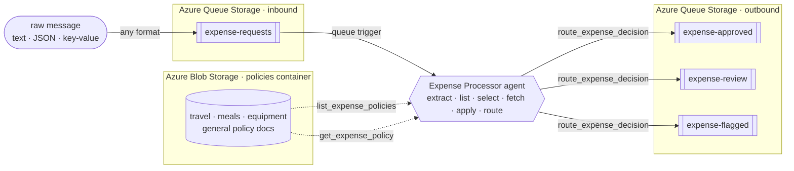

# How it works

A message lands on the `expense-requests` queue and triggers exactly one agent run over that one
item. There's no hand-written parser and no rules engine. The agent reads the raw message, works out
which spending policy applies, fetches that policy from Blob Storage, applies it, and routes its
decision to the right queue.

## Why an agent, and not a rules engine?

Expense and purchase-order requests rarely arrive as clean, validated JSON. They show up as Slack
messages, forwarded emails, quick notes, or half-structured text from a dozen intake tools, and a
real finance org doesn't run every one through the *same* rulebook. Travel, meals, and capital
equipment each have their own thresholds and their own exceptions. A traditional function would need
a parser for every format and a rules engine that encodes every policy.

This sample replaces that with a single **markdown-defined agent**. The decision isn't a field lookup
or an `if/else` on a number. It uses *retrieval + selection + reasoning*: the agent reads a messy,
human-written message, extracts the amount / currency / category / vendor, **chooses the right policy
from several**, reads that natural-language document, and reasons over the two together.

Because the policies are **documents the agent reads at runtime**, and it *chooses among them*, the
people who own spending policy can change how a whole category is triaged, or add a brand-new policy,
by editing files. No engineer, no deploy. See [use-cases.md](use-cases.md) for the proof that it's
genuinely reasoning rather than matching a fixed schema.

## Architecture



It runs on **Azure Functions Flex Consumption**, so it scales to zero and costs nothing when the
queue is empty.

## The agent, step by step

The entire agent is defined declaratively in
[`src/agents/expense_processor.agent.md`](../src/agents/expense_processor.agent.md). The front matter
wires the queue trigger, and the markdown body *is* the system prompt. It does the work in eight steps:

1. **Extract:** pull `amount`, `currency`, `category`, `vendor`, and an `expenseId` out of the raw
   message, wherever and however they appear (`$1,250`, `1.250,00`, and `twelve hundred dollars` all
   describe a number).
2. **List:** call the `list_expense_policies` tool to see which policy documents exist and what each
   one covers.
3. **Select:** choose the single policy whose scope matches the expense category (or the general
   policy when nothing else fits).
4. **Fetch:** call the `get_expense_policy` tool with that document's name to read its full text (a
   fresh read every request, so policy edits take effect immediately).
5. **Decide:** apply the policy it just fetched, in order; the first matching rule wins.
6. **Build:** assemble a compact decision JSON, including `policyApplied` so the chosen policy is
   visible.
7. **Route:** call the `route_expense_decision` tool to enqueue the decision on the destination queue.
8. **Respond:** return the decision JSON so the outcome is visible in the logs and traces.

## The policies live in documents, and the agent picks one

The rules come from a set of markdown documents in [`src/policies/`](../src/policies/), stored as
blobs in the `policies` container on the same storage account as the queues:

| Policy document | Applies to | Auto-approve ≤ | Review band | Flag > |
|---|---|---|---|---|
| `travel-policy.md` | flights, hotels, rail, taxis, car rental, mileage | **$1,000** | $1,000 to $5,000 | $5,000 |
| `meals-entertainment-policy.md` | meals, team lunches/dinners, catering, client entertainment | **$150** | $150 to $1,000 | $1,000 |
| `equipment-software-policy.md` | laptops, monitors, peripherals, software, subscriptions | **$500** | $500 to $2,500 | $2,500 |
| `general-expense-policy.md` | anything the specific policies don't cover (fallback) | **$100** | $100 to $1,000 | $1,000 |

Each policy also applies judgment on top of the amount. A **cash advance** or a request with **no
clear amount** is `flagged`, a **non-USD** amount is `routed` for FX verification (the agent won't
guess a rate), and category quirks like **client entertainment** or **premium travel** always get a
human look.

Each document starts with an `**Applies to:**` line that the `list_expense_policies` tool surfaces as
the policy's scope, which is how the agent knows which one to fetch. The bundled documents are
**seeded automatically at deploy time** (see [deploy.md](deploy.md#auto-seeding-and-the-demo-send)),
and the agent re-seeds on its first run if the container is ever empty.

## Managed identity, not keys

The agent touches storage through three custom tools, and **all authenticate with the Function app's
user-assigned managed identity** (`DefaultAzureCredential`). The trigger uses the same identity:

- **[`list_expense_policies`](../src/tools/list_policies.py)** lists the policy documents and their
  scopes from Blob Storage.
- **[`get_expense_policy`](../src/tools/get_policy.py)** reads one chosen policy document from Blob
  Storage.
- **[`route_expense_decision`](../src/tools/route_decision.py)** writes the decision to the
  destination queue with the Azure Queue Storage SDK.

That identity holds **Storage Blob Data** and **Storage Queue Data Contributor** roles on the account,
so reads and writes need **no keys and no connection strings**. The account keeps shared-key access
disabled (`allowSharedKeyAccess: false`), and the tools still work because every call is
Entra-authenticated.

> Locally the same tools use the Azurite development connection string for both the policy blobs and
> the queues, so the agent behaves identically end to end without any cloud dependency.

## Under the hood: message encoding

The project sends **raw text** (not base64) so messages are human-readable in the portal. Three
settings make that work end to end:

- `host.json` → `extensions.queues.messageEncoding: "none"`: the host passes the queue text through
  unchanged.
- The agent trigger sets `data_type: string`.
- Serverless Agents Runtime `0.1.0b8` serializes the `QueueMessage` body and metadata before adding
  them to the agent prompt.

## Repo layout

```
src/
  agents/
    expense_processor.agent.md # the agent: extract -> list -> select -> fetch -> apply -> route
  policies/                    # the policy library, seeded to Blob Storage at deploy time
    general-expense-policy.md  #   fallback / catch-all (also the POLICY_BLOB default)
    travel-policy.md           #   flights, hotels, rail, taxis, car rental, mileage
    meals-entertainment-policy.md  # meals, catering, client entertainment
    equipment-software-policy.md   # hardware, software, subscriptions
  tools/
    list_policies.py           # custom tool: lists the policy documents + scopes (managed identity)
    get_policy.py              # custom tool: reads one chosen policy document (managed identity)
    route_decision.py          # custom tool: writes the decision to a queue (managed identity)
    _policy_store.py           # shared blob-storage helpers for the policy tools (not a tool itself)
  function_app.py              # standard serverless agents runtime entry point
  agents.config.yaml           # runtime defaults (timeout)
  host.json                    # queue messageEncoding + logging config
  pyproject.toml               # function app dependencies (uv is the source of truth)
  uv.lock                      # pinned dependency lockfile
  local.settings.json.sample   # app settings reference
infra/                         # azd / Bicep: Functions, Foundry, storage (queues + policies blob), identity, RBAC
scripts/                       # uv run helper scripts: send / read / set-policy (PEP 723, self-describing deps)
samples/                       # varied formats + the $450-per-category set + a stricter travel policy for the swap demo
azure.yaml                     # azd service definition + hooks (generate requirements.txt, seed policies, demo send)
```

---

Next: [use-cases.md](use-cases.md) · [customize.md](customize.md) · [deploy.md](deploy.md) ·
[troubleshooting.md](troubleshooting.md)
